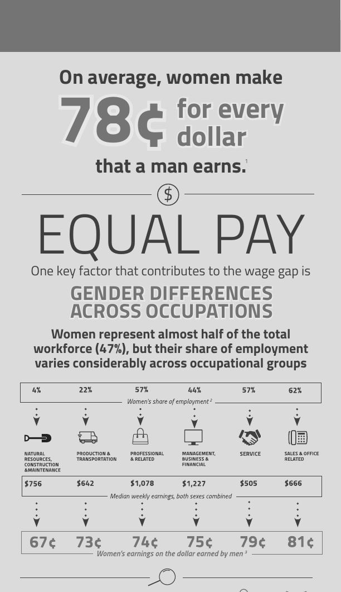
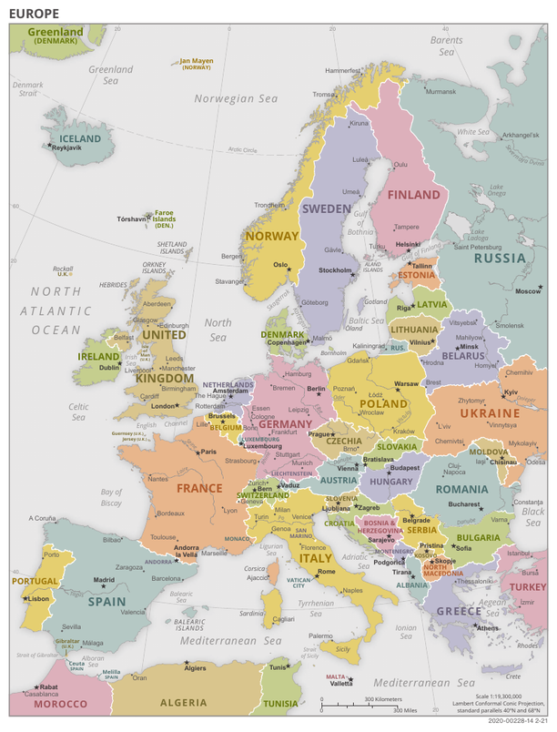
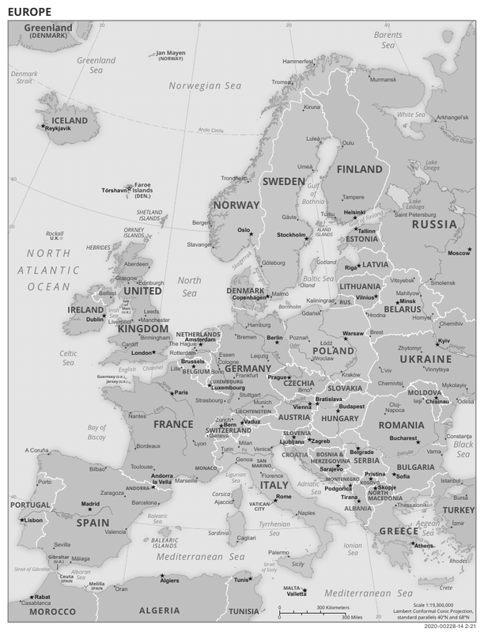
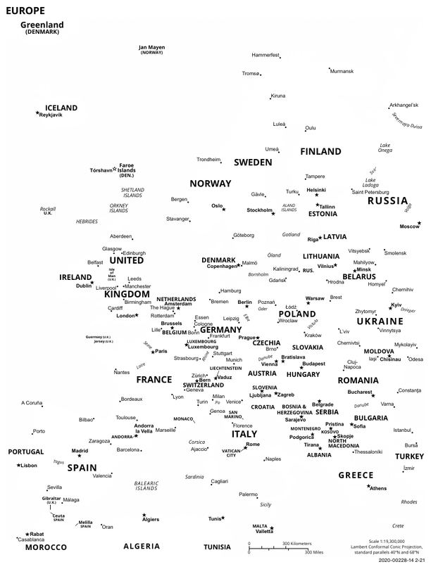

# Sumi

English | [日本語](README.md)

A Rust library and CLI that converts the colors of a PDF to grayscale or black and white (monochrome).
It rewrites only the color operators instead of rasterizing pages, so text search, copying, fonts and vector quality are preserved.
It does not depend on AGPL software such as Ghostscript.

See [sumi_spec.md](sumi_spec.md) (Japanese) for the specification. Changes from the specification are listed in "[Differences from the specification](#differences-from-the-specification)".

## Examples

These are public domain PDFs from Wikimedia Commons, converted with sumi. The images are renderings of the PDFs before and after conversion made with poppler; the infographic is cropped to its top part.

### Infographic

| Original PDF | Grayscale | Monochrome |
|---|---|---|
|  |  |  |

```bash
sumi samples/equal-pay.pdf -o samples/equal-pay-grayscale.pdf
sumi samples/equal-pay.pdf -o samples/equal-pay-monochrome.pdf --mode monochrome
```

Even in monochrome, the headings, figures and charts stay readable. The PDFs before and after conversion are in [samples/](samples/).

Source: [Equal Pay Infographic](https://commons.wikimedia.org/wiki/File:Equal_Pay_Infographic.pdf) (U.S. Department of Labor, public domain)

### Map

| Original PDF | Grayscale | Monochrome |
|---|---|---|
|  |  |  |

In grayscale, the countries keep different shades. In monochrome, every pale color becomes white, so the fills and coastlines disappear and only the place names remain. Use grayscale for documents that convey information through color differences.

Source: [Political map of Europe](https://commons.wikimedia.org/wiki/File:Political_map_of_Europe.pdf) (CIA World Factbook, public domain)

## Comparison with Ghostscript and mutool

We converted the same PDFs to grayscale and compared run time, memory usage and output with Ghostscript and MuPDF's `mutool recolor`, on two machines: a Mac (Apple M1 Pro) and a Linux PC (AMD Ryzen 7 6800H). The input names in the tables link to the PDFs used.

sumi's output sizes were re-measured after output switched to object streams and cross-reference streams ([#9](https://github.com/champierre/sumi/issues/9)); sumi's output size is the same on every platform. Run time and memory usage were measured before that change (0.1.0). Comparing before and after on a different Mac (Intel), the 50-page invoice took about 30% longer and used about 60% more memory (19 MB → 31 MB); the other five inputs barely changed.

Like sumi, `mutool recolor` rewrites only the color operators without rasterizing pages. Since it does not redraw the page the way Ghostscript does, it is the tool closest to sumi. However, MuPDF is also made by Artifex, like Ghostscript, and is licensed under AGPL-3.0 (or a commercial license). That is why sumi is MIT-licensed.

### Run time

#### Mac (Apple M1 Pro, Ghostscript 10.05.1, mutool 1.28.3)

| Input | Pages | sumi | Ghostscript | mutool | vs. Ghostscript | vs. mutool |
|---|---:|---:|---:|---:|---:|---:|
| [Invoice](fixtures/chrome_invoice.pdf) (Chrome, 0.34 MB) | 2 | 21 ms | 153 ms | 182 ms | 7.2× | 8.6× |
| [Invoice, 50 pages](bench/invoice-50pages.pdf) (Chrome, 1.0 MB) | 50 | 64 ms | 2,553 ms | 2,071 ms | 40.1× | 32.5× |
| [Infographic](https://upload.wikimedia.org/wikipedia/commons/f/f8/Equal_Pay_Infographic.pdf) (Adobe, 0.30 MB) | 1 | 33 ms | 176 ms | 56 ms | 5.4× | 1.7× |
| [NASA fact sheet](https://upload.wikimedia.org/wikipedia/commons/7/79/0080_SLS_Fact_Sheet_10162019_PRINT_FINAL_%28656622902519%29.pdf) (Acrobat Distiller, 0.30 MB) | 2 | 56 ms | 808 ms | 97 ms | 14.6× | 1.8× |
| [Poster](https://upload.wikimedia.org/wikipedia/commons/9/91/Best_Case_Scenarios_for_Copyright_-_poster.pdf) (cairo, 5.9 MB) | 1 | 532 ms | 1,235 ms | 906 ms | 2.3× | 1.7× |
| [Map](https://upload.wikimedia.org/wikipedia/commons/1/12/Political_map_of_Europe.pdf) (Aspose, 6.7 MB) | 1 | 1,373 ms | 3,249 ms | 1,925 ms | 2.4× | 1.4× |

#### Linux (AMD Ryzen 7 6800H, Ghostscript 10.07.1, mutool 1.28.0)

| Input | Pages | sumi | Ghostscript | mutool | vs. Ghostscript | vs. mutool |
|---|---:|---:|---:|---:|---:|---:|
| [Invoice](fixtures/chrome_invoice.pdf) (Chrome, 0.34 MB) | 2 | 21 ms | 150 ms | 194 ms | 7.2× | 9.3× |
| [Invoice, 50 pages](bench/invoice-50pages.pdf) (Chrome, 1.0 MB) | 50 | 62 ms | 2,574 ms | 2,285 ms | 41.2× | 36.6× |
| [Infographic](https://upload.wikimedia.org/wikipedia/commons/f/f8/Equal_Pay_Infographic.pdf) (Adobe, 0.30 MB) | 1 | 36 ms | 154 ms | 57 ms | 4.3× | 1.6× |
| [NASA fact sheet](https://upload.wikimedia.org/wikipedia/commons/7/79/0080_SLS_Fact_Sheet_10162019_PRINT_FINAL_%28656622902519%29.pdf) (Acrobat Distiller, 0.30 MB) | 2 | 59 ms | 621 ms | 92 ms | 10.6× | 1.6× |
| [Poster](https://upload.wikimedia.org/wikipedia/commons/9/91/Best_Case_Scenarios_for_Copyright_-_poster.pdf) (cairo, 5.9 MB) | 1 | 596 ms | 1,192 ms | 886 ms | 2.0× | 1.5× |
| [Map](https://upload.wikimedia.org/wikipedia/commons/1/12/Political_map_of_Europe.pdf) (Aspose, 6.7 MB) | 1 | 1,585 ms | 3,320 ms | 1,914 ms | 2.1× | 1.2× |

Median of 10 runs. "vs. Ghostscript" and "vs. mutool" show how many times faster sumi was.

- sumi was faster than Ghostscript on all six inputs on both machines, by 2.3–40.1× on the Mac and 2.0–41.2× on Linux. Ghostscript interprets and redraws the PDF, while sumi only rewrites the color operators, so the gap widens for business documents with many pages.
- sumi was also faster than mutool on all six inputs on both machines, by 1.4–32.5× on the Mac and 1.2–36.6× on Linux. mutool also rewrites color operators, so the gap is smaller than with Ghostscript. For large single-page PDFs (the poster and the map) the difference is small, 1.2–1.7×.
- The gap is widest for business documents with many pages. Comparing the 2-page and 50-page versions of the same invoice (the content repeated 25 times) on Linux, mutool went from 194 ms to 2,285 ms (11.8×) and Ghostscript from 150 ms to 2,574 ms (17.2×), while sumi went from 21 ms to 62 ms (3.0×). The Mac shows the same trend: 11.4× for mutool, 16.7× for Ghostscript and 3.0× for sumi.

### Memory usage

#### Mac (Apple M1 Pro)

| Input | sumi | Ghostscript | mutool |
|---|---:|---:|---:|
| [Invoice](fixtures/chrome_invoice.pdf) (0.34 MB) | 10.2 MB | 30.9 MB | 29.6 MB |
| [Invoice, 50 pages](bench/invoice-50pages.pdf) (1.0 MB) | 20.9 MB | 86.5 MB | 441.0 MB |
| [Infographic](https://upload.wikimedia.org/wikipedia/commons/f/f8/Equal_Pay_Infographic.pdf) (0.30 MB) | 6.2 MB | 28.0 MB | 7.1 MB |
| [NASA fact sheet](https://upload.wikimedia.org/wikipedia/commons/7/79/0080_SLS_Fact_Sheet_10162019_PRINT_FINAL_%28656622902519%29.pdf) (0.30 MB) | 9.0 MB | 43.2 MB | 17.5 MB |
| [Poster](https://upload.wikimedia.org/wikipedia/commons/9/91/Best_Case_Scenarios_for_Copyright_-_poster.pdf) (5.9 MB) | 34.6 MB | 38.5 MB | 54.2 MB |
| [Map](https://upload.wikimedia.org/wikipedia/commons/1/12/Political_map_of_Europe.pdf) (6.7 MB) | 87.5 MB | 36.1 MB | 69.4 MB |

#### Linux (AMD Ryzen 7 6800H)

| Input | sumi | Ghostscript | mutool |
|---|---:|---:|---:|
| [Invoice](fixtures/chrome_invoice.pdf) (0.34 MB) | 10.5 MB | 31.6 MB | 44.6 MB |
| [Invoice, 50 pages](bench/invoice-50pages.pdf) (1.0 MB) | 20.2 MB | 78.8 MB | 462.5 MB |
| [Infographic](https://upload.wikimedia.org/wikipedia/commons/f/f8/Equal_Pay_Infographic.pdf) (0.30 MB) | 6.8 MB | 29.0 MB | 21.3 MB |
| [NASA fact sheet](https://upload.wikimedia.org/wikipedia/commons/7/79/0080_SLS_Fact_Sheet_10162019_PRINT_FINAL_%28656622902519%29.pdf) (0.30 MB) | 8.6 MB | 35.4 MB | 31.1 MB |
| [Poster](https://upload.wikimedia.org/wikipedia/commons/9/91/Best_Case_Scenarios_for_Copyright_-_poster.pdf) (5.9 MB) | 30.8 MB | 36.6 MB | 63.1 MB |
| [Map](https://upload.wikimedia.org/wikipedia/commons/1/12/Political_map_of_Europe.pdf) (6.7 MB) | 72.7 MB | 32.8 MB | 87.8 MB |

Median of 10 runs of the process's maximum resident set size.

- sumi used less memory than Ghostscript on five of the six inputs on both machines: 21–90% of Ghostscript's (Mac) and 23–84% (Linux). For PDFs up to about 1 MB it was 21–33% (Mac) and 23–33% (Linux).
- sumi used less memory than mutool on all six inputs on Linux (4–83% of mutool's) and on five of six on the Mac (5–88%). Only the map on the Mac used more with sumi, 126% of mutool's.
- sumi loads the whole PDF into memory to convert it, so larger files use more memory. For the 6.7 MB map it used more than Ghostscript (87.5 MB vs. 36.1 MB on the Mac, 72.7 MB vs. 32.8 MB on Linux).
- Ghostscript used 28–43 MB (Mac) and 29–35 MB (Linux) for 1–2 page PDFs, but 86.5 MB (Mac) and 78.8 MB (Linux) for the 50-page invoice.
- mutool used 462.5 MB (Linux) and 441.0 MB (Mac) for the 50-page invoice, far more than for any other input on either machine. The 2-page version of the same content used 44.6 MB (Linux) and 29.6 MB (Mac), so its memory appears to grow sharply with the page count. sumi used 20.2 MB (Linux) and 20.9 MB (Mac) for the same PDF.

### Output

| Input | Original PDF | sumi | Ghostscript 10.05.1 (Mac) | Ghostscript 10.07.1 (Linux) | mutool 1.28.3 (Mac) | mutool 1.28.0 (Linux) |
|---|---:|---:|---:|---:|---:|---:|
| [Invoice](fixtures/chrome_invoice.pdf) | 0.34 MB | 0.21 MB | 0.18 MB | 0.18 MB | 0.25 MB | 0.25 MB |
| [Invoice, 50 pages](bench/invoice-50pages.pdf) | 1.03 MB | 0.57 MB | 1.13 MB | 1.12 MB | 0.88 MB | 0.88 MB |
| [Infographic](https://upload.wikimedia.org/wikipedia/commons/f/f8/Equal_Pay_Infographic.pdf) | 0.30 MB | 0.28 MB | 0.26 MB | 0.26 MB | 0.28 MB | 0.28 MB |
| [NASA fact sheet](https://upload.wikimedia.org/wikipedia/commons/7/79/0080_SLS_Fact_Sheet_10162019_PRINT_FINAL_%28656622902519%29.pdf) | 0.30 MB | 0.84 MB | 0.51 MB | 0.24 MB | 0.83 MB | 0.84 MB |
| [Poster](https://upload.wikimedia.org/wikipedia/commons/9/91/Best_Case_Scenarios_for_Copyright_-_poster.pdf) | 5.90 MB | 5.90 MB | 4.51 MB | 4.65 MB | 5.77 MB | 5.77 MB |
| [Map](https://upload.wikimedia.org/wikipedia/commons/1/12/Political_map_of_Europe.pdf) | 6.70 MB | 7.10 MB | 7.20 MB | 7.20 MB | 7.06 MB | 7.06 MB |

sumi's output was the same size on the Mac and Linux. mutool's output was also nearly identical; only the NASA fact sheet differed (834,194 bytes on the Mac, 839,491 bytes on Linux).

sumi saves its output with object streams, which pack dictionaries such as pages and fonts together and compress them, and a cross-reference stream, which stores the cross-reference table compactly. The effect is large for invoices, which contain many dictionaries (0.1.0, which did not use object streams, produced 0.31 MB for the invoice and 0.98 MB for the 50-page invoice).

- **Output size (Ghostscript)**: Ghostscript's output was smaller for the NASA fact sheet and the poster, which contain photos. sumi re-saves JPEG images with lossless compression (Flate), whereas Ghostscript recompresses them as JPEG. For the NASA fact sheet, Ghostscript 10.07.1 on Linux produced 0.24 MB, less than half of 10.05.1 on the Mac (0.51 MB).
- **Output size (mutool)**: For the invoices, which contain no photos, sumi's output was smaller than mutool's (by 17.6% for the invoice and 35.9% for the 50-page invoice). For the other four inputs mutool's output was 0.1–2.2% smaller, i.e. about the same. mutool also re-saves JPEG images losslessly, so photo-heavy PDFs grow the same way (for the NASA fact sheet, sumi produced 840,273 bytes and mutool 839,491 bytes, both up from 0.30 MB to 0.84 MB). If you want small output from photo-heavy PDFs, Ghostscript, which recompresses images as JPEG, is the better fit.
- **Appearance**: Rendering the three outputs on both machines showed nearly identical results with no color left in any of them. The rendering differences between sumi and mutool were about the same as between sumi and Ghostscript, mostly anti-aliasing along glyph edges.
- **Text**: Text extracted from sumi's output matched the original PDF exactly for all six inputs on both machines. So did mutool's, so this metric does not separate sumi and mutool. In Ghostscript's output, the extraction order of the invoice text changed, and "発行日" (issue date) could no longer be found as a contiguous string (no characters were lost; Mac and Linux alike). On the Mac, Ghostscript 10.05.1 extracted the "fi" and "fl" ligatures in the NASA fact sheet as "Þ" and "ß", so searching for "first" failed. Ghostscript 10.07.1 on Linux did not have this problem; only the extraction order of one paragraph changed.

### Methodology

- **Environment**: Measured on the two machines below, with sumi 0.1.0 (`cargo build --release`) on both. The Mac was measured on September 13, 2026 and Linux on September 12, 2026 (both re-measured after adding mutool).

  | | Mac | Linux |
  |---|---|---|
  | Machine | Apple M1 Pro (16 GB memory) | GEEKOM A6, AMD Ryzen 7 6800H (32 GB memory) |
  | OS | macOS 26.5.2 | Omarchy 4.0.1 (based on Arch Linux, Linux 7.1.9) |
  | Ghostscript | 10.05.1 (Homebrew) | 10.07.1 (Arch Linux package) |
  | mutool | 1.28.3 (Homebrew mupdf-tools) | 1.28.0 (Arch Linux mupdf-tools) |

- **How the tools were run**: Each tool was run as a command, as an application would call it, and the measurement includes process startup. Each PDF was run once as a warm-up and then 10 times. Time and memory were taken with `/usr/bin/time` (`-l` on macOS, GNU time `-v` on Linux).
- **Commands**:

  ```bash
  sumi input.pdf -o output.pdf --overwrite

  gs -q -dNOPAUSE -dBATCH -dSAFER -sDEVICE=pdfwrite \
     -sColorConversionStrategy=Gray -dProcessColorModel=/DeviceGray \
     -o output.pdf input.pdf

  mutool recolor -c gray -o output.pdf input.pdf
  ```

- **Output checks**: We rendered the output with poppler's `pdftoppm` to check that no colored pixels remain, and checked whether the text extracted with `pdftotext` matches the original PDF.
- **Not compared**: Neither Ghostscript nor `mutool recolor` can convert to black and white while keeping vectors (`mutool recolor -c` supports only gray, rgb and cmyk), so only grayscale conversion was compared.
- **Inputs**:

  | Input | PDF | Source |
  |---|---|---|
  | Invoice | [chrome_invoice.pdf](fixtures/chrome_invoice.pdf) | [fixtures/src/invoice.html](fixtures/src/invoice.html) printed to PDF with Chrome |
  | Invoice, 50 pages | [invoice-50pages.pdf](bench/invoice-50pages.pdf) | `fixtures/src/invoice.html` repeated 25 times and printed to PDF with Chrome |
  | Infographic | [Equal_Pay_Infographic.pdf](https://upload.wikimedia.org/wikipedia/commons/f/f8/Equal_Pay_Infographic.pdf) | [Equal Pay Infographic](https://commons.wikimedia.org/wiki/File:Equal_Pay_Infographic.pdf) (public domain) |
  | NASA fact sheet | [0080_SLS_Fact_Sheet_…pdf](https://upload.wikimedia.org/wikipedia/commons/7/79/0080_SLS_Fact_Sheet_10162019_PRINT_FINAL_%28656622902519%29.pdf) | [SLS Fact Sheet](https://commons.wikimedia.org/wiki/File:0080_SLS_Fact_Sheet_10162019_PRINT_FINAL_(656622902519).pdf) (public domain) |
  | Poster | [Best_Case_Scenarios_for_Copyright_-_poster.pdf](https://upload.wikimedia.org/wikipedia/commons/9/91/Best_Case_Scenarios_for_Copyright_-_poster.pdf) | [Best Case Scenarios for Copyright - poster](https://commons.wikimedia.org/wiki/File:Best_Case_Scenarios_for_Copyright_-_poster.pdf) (CC0) |
  | Map | [Political_map_of_Europe.pdf](https://upload.wikimedia.org/wikipedia/commons/1/12/Political_map_of_Europe.pdf) | [Political map of Europe](https://commons.wikimedia.org/wiki/File:Political_map_of_Europe.pdf) (public domain) |

- **Reproducing**:

  ```bash
  cargo build --release
  python3 bench/fetch.py        # put the input PDFs in bench/inputs (downloaded from Wikimedia Commons)
  python3 bench/bench.py        # run the benchmark; results go to bench/results-macos.json or bench/results-linux.json
  ```

  `bench.py` looks for `gs` and `mutool` on the PATH and skips any that are missing. If they are installed elsewhere, pass their paths with `--gs` and `--mutool`.

  The 50-page invoice used for the measurements is committed as `bench/invoice-50pages.pdf`; both the Mac and Linux were measured with this file. To rebuild it, run `python3 bench/make_batch.py` (requires Google Chrome).

These measurements come from two machines, so the numbers will vary by environment. For small PDFs in particular, process startup accounts for a large share of the time. Ghostscript and mutool results also vary by version and options.

## Installation

Prebuilt CLI binaries are available from [GitHub Releases](https://github.com/champierre/sumi/releases/latest).

| OS | File |
|---|---|
| macOS (Apple Silicon) | `sumi-aarch64-apple-darwin.tar.gz` |
| macOS (Intel) | `sumi-x86_64-apple-darwin.tar.gz` |
| Windows (x64) | `sumi-x86_64-pc-windows-msvc.zip` |
| Linux (x86_64) | `sumi-x86_64-unknown-linux-musl.tar.gz` |
| Linux (arm64) | `sumi-aarch64-unknown-linux-musl.tar.gz` |

```bash
# Example: macOS (Apple Silicon)
curl -L https://github.com/champierre/sumi/releases/latest/download/sumi-aarch64-apple-darwin.tar.gz | tar xz
sudo mv sumi-aarch64-apple-darwin/sumi /usr/local/bin/
```

The Linux builds are statically linked (musl), so they run on any distribution. If macOS blocks a binary downloaded with a browser, run `xattr -d com.apple.quarantine sumi`.

### Ruby (gem)

For Ruby applications, you can use the [sumi-ruby](ruby/README.md) (Japanese) gem, which bundles the prebuilt CLI. `bundle install` is all it takes, and `Gemfile.lock` keeps the same sumi version across development, CI and production. The gem version matches the sumi version.

```ruby
# Gemfile
gem "sumi-ruby"
```

```bash
bundle exec sumi input.pdf -o output.pdf
```

Gems are available for Linux (x86_64 and arm64, glibc and musl), macOS (Apple Silicon and Intel) and Windows (x64). If development and production run on different platforms, add the platforms to `Gemfile.lock`, e.g. `bundle lock --add-platform x86_64-linux-gnu`. See [ruby/README.md](ruby/README.md) (Japanese) for details.

### Building from source

```bash
cargo install --git https://github.com/champierre/sumi sumi-cli
# or
cargo build --release   # => target/release/sumi
```

Requires Rust 1.88 or later (edition 2024).

## CLI

```bash
sumi input.pdf -o output.pdf
sumi input.pdf -o output.pdf --mode monochrome --threshold 0.5
cat input.pdf | sumi - -o - > output.pdf
```

| Option | Description |
|---|---|
| `-o, --output <FILE>` | Output file. `-` writes to standard output |
| `--mode grayscale\|monochrome` | Conversion mode (default: `grayscale`) |
| `--gray-model luma\|colorimetric` | Formula for converting RGB to gray (default: `luma`). See "[Conversion formulas](#conversion-formulas)" |
| `--threshold <0.0-1.0>` | Threshold for monochrome (default: `0.5`). Levels below this value become black |
| `--dither` | In monochrome, binarize images with error diffusion (Floyd–Steinberg) instead of the threshold |
| `--strict` | Fail instead of leaving parts that cannot be converted in their original colors |
| `--overwrite` | Overwrite the output file if it already exists |
| `--timeout <SECONDS>` | Abort after the given number of seconds |
| `-v, --verbose` | Print the number of converted items |
| `--report json` | Print the conversion result as JSON on standard error. See "[JSON report](#json-report)" |

Parts that cannot be converted are left in their original colors, with `sumi: warning: ...` printed on standard error (with `--strict`, sumi exits with an error instead).
Output is first written to a temporary file and then renamed, so a failed conversion never leaves a broken file behind.

### Exit codes

| Code | Meaning |
|---|---|
| 0 | Success |
| 1 | Other errors (such as exceeding a resource limit) |
| 2 | Invalid arguments (the output file already exists, input and output are the same file, etc.) |
| 3 | Not a readable PDF |
| 4 | Unsupported PDF (encrypted, or `--strict` found parts that cannot be converted) |
| 5 | I/O error |
| 6 | Timeout |

### JSON report

With `--report json`, sumi prints the result as a single line of JSON on standard error when it exits. It uses the same format on failure. Use it when calling sumi from an application and handling the page count or warnings programmatically.

In this mode, `sumi: warning: ...` warnings and the `-v` counts are not printed as text (both are included in the JSON). Standard error contains only the one JSON line, so it can be parsed as is. Standard output is not used for the JSON because `-o -` writes the PDF there.

```json
{"status":"ok","exit_code":0,"mode":"grayscale","gray_model":"luma","report":{"pages":2,"content_streams":3,"color_operators":74,"images":2,"shadings":1,"warnings":[]},"error":null}
```

On failure (here, `--strict` found parts that cannot be converted):

```json
{"status":"error","exit_code":4,"mode":"grayscale","gray_model":"luma","report":null,"error":{"kind":"unsupported","message":"unsupported PDF features: image not converted: YCCK (Adobe CMYK) JPEG image","details":["image not converted: YCCK (Adobe CMYK) JPEG image"]}}
```

| Key | Contents |
|---|---|
| `status` | `ok` or `error` |
| `exit_code` | The exit code (same as the table above) |
| `mode` | `grayscale` or `monochrome` |
| `gray_model` | `luma` or `colorimetric` |
| `report` | The conversion result. `null` if sumi failed before converting |
| `report.pages` | Number of pages. sumi never adds or removes pages, so this is the same before and after conversion |
| `report.content_streams` `report.color_operators` `report.images` `report.shadings` | Number of converted items (same as `-v`) |
| `report.warnings` | Parts left in their original colors: an array of `message` (description) and `count` (how many times the same warning occurred) |
| `error` | Details of the failure. `null` on success |
| `error.kind` | Kind of failure: one of `invalid_arguments` `invalid_pdf` `encrypted_pdf` `unsupported` `io` `timeout` `limit_exceeded` `internal` |
| `error.message` | Description of the failure. The wording may change, so use `kind` to branch on the failure |
| `error.details` | For `unsupported`, the list of parts that could not be converted. Otherwise an empty array |

- All keys are always present. Keys that do not apply are `null` or an empty array
- Mistakes in the arguments, such as an unknown option, are reported as text, not JSON. They are detected while the arguments are parsed, before sumi can tell whether `--report json` was given

## Rust API

```rust
use sumi_core::{convert, convert_bytes, ConvertOptions, Mode};

let mut options = ConvertOptions::default();
options.mode = Mode::Monochrome;
options.threshold = 0.6;
let report = convert("input.pdf", "output.pdf", &options)?;

// Convert in memory
let converted = convert_bytes(&std::fs::read("input.pdf")?, &ConvertOptions::grayscale())?;
println!("{} images converted, {} warnings", converted.report.images, converted.report.warnings.len());

// Shorthand API
sumi_core::grayscale("input.pdf", "output.pdf")?;
```

`ConvertOptions` and `Report` are `#[non_exhaustive]`. So that adding fields in the future is not a breaking change, create them with `ConvertOptions::default()` or similar and then set the fields.

## Using from Rails

```ruby
require "json"
require "open3"
require "sumi/ruby"

class PdfGrayscaleConverter
  class ConversionError < StandardError; end

  # Use the executable from the sumi-ruby gem. Without the gem, use e.g. ENV.fetch("SUMI_PATH", "sumi")
  SUMI = Sumi::Ruby.executable

  # Returns the conversion result (page count, converted items, warnings)
  def self.call(input_path:, output_path:)
    # A Tempfile path already exists, so --overwrite is required
    _stdout, stderr, status = Open3.capture3(
      SUMI, input_path.to_s, "-o", output_path.to_s, "--overwrite", "--timeout", "30", "--report", "json"
    )
    result = JSON.parse(stderr)
    raise ConversionError, "#{result.dig("error", "kind")}: #{result.dig("error", "message")}" unless status.success?

    result["report"]
  end
end
```

You can also pass the PDF through standard input and output instead of files, e.g. `Open3.capture3(SUMI, "-", "-o", "-", stdin_data: pdf_bytes, binmode: true)`.

## What gets converted

| Target | Handling |
|---|---|
| `rg` `RG` `k` `K` `g` `G` in content streams | Replaced with `g` / `G` |
| `cs` `CS` `sc` `SC` `scn` `SCN` | The color space is tracked (including `q`/`Q` save and restore) and replaced with `/DeviceGray` |
| Color spaces | DeviceGray/RGB/CMYK, CalGray/CalRGB, Lab, ICCBased (N=1/3/4), Indexed, Separation, DeviceN (Type 0/2/3/4 functions are evaluated), Pattern (with an underlying color space) |
| Form XObjects, tiling patterns, Type 3 font glyphs | Converted recursively |
| Image XObjects | For Indexed images only the palette is replaced with gray (pixel data is kept). Others are re-encoded as 8-bit gray (1-bit in monochrome) with Flate. Supports FlateDecode (including predictors), LZW, ASCII85, ASCIIHex, RunLength and DCTDecode (JPEG). A color-key `/Mask` becomes an SMask |
| Inline images (`BI`…`EI`) | Same as above |
| Shadings (gradients) | The function is sampled at 256 points (33×33 for function-based shadings) and replaced with a gray sampled function |
| `/CS` of transparency groups | Changed to `/DeviceGray` |
| Annotations | Appearance streams (`/AP`), `/C` `/IC`, `/BG` `/BC` in `/MK`, `/DA` |
| Form fields | `/DA` of the AcroForm and of each field |

Everything other than color — text-showing operators, fonts, paths, strings, comments — is copied byte for byte.

Output is saved with object streams and a cross-reference stream. Both are PDF 1.5 features, so the header version is raised to 1.5 when the input is PDF 1.4 or older. Uncompressed streams are compressed with Flate (XMP metadata is left uncompressed so that other tools can read it).

### Conversion formulas

sumi uses the DeviceRGB/DeviceCMYK → DeviceGray formulas given in the PDF specification (ISO 32000-1, 10.3), the same ones Acrobat and Ghostscript (without ICC) use.

```text
Gray = 0.30 × R + 0.59 × G + 0.11 × B
Gray = 1 − min(1, 0.30 × C + 0.59 × M + 0.11 × Y + K)
```

With `--gray-model colorimetric`, RGB is converted with the formula below: the RGB values are read as sRGB, linearized, the luminance is computed, and the result is encoded back with the sRGB curve.

```text
Y    = 0.2126 × lin(R) + 0.7152 × lin(G) + 0.0722 × lin(B)
Gray = lin⁻¹(Y)          (lin converts an sRGB value to linear light)
```

`luma`, which applies the weights directly to the gamma-encoded values, makes primary colors, especially blue, dark. `colorimetric` gives values close to Ghostscript's default ICC-based conversion. Neutral colors (R = G = B) are unchanged by either formula.

| Original color | `luma` | `colorimetric` | Ghostscript 10.02.1 (default) |
|---|---:|---:|---:|
| Red (1, 0, 0) | 0.300 | 0.498 | 0.506 |
| Green (0, 1, 0) | 0.590 | 0.863 | 0.863 |
| Blue (0, 0, 1) | 0.110 | 0.298 | 0.271 |
| Yellow (1, 1, 0) | 0.890 | 0.968 | 0.973 |
| (0.2, 0.4, 0.8) | 0.384 | 0.418 | 0.408 |

Ghostscript was run with `-sColorConversionStrategy=Gray -dProcessColorModel=/DeviceGray`. With `-dUseFastColor=true` (no ICC) it gives the same values as `luma`. CMYK and Lab are always converted with the formulas above, regardless of `--gray-model`.

In monochrome, `Gray < threshold` becomes black and everything else white. `Gray` is computed with the formula selected by `--gray-model`.

## Limitations

- **CMYK appearance**: CMYK uses the simple formula above, so cyan and similar colors come out lighter than in an ICC color-managed rendering (e.g. 100% cyan becomes 0.70, while converting poppler's rendering to gray gives about 0.5).
- **Information lost in monochrome**: Thresholding makes text in light colors such as yellow disappear on white paper. Pale background colors disappear too, and knocked-out (white) text can merge into its background.
- **Left in their original colors because they are unsupported** (with a warning): mesh shadings (Type 4–7) without a function, color images encoded with JPEG 2000 / JBIG2 / CCITT, and streams with parameters on more than one filter.
- **Encrypted PDFs** are not converted (including PDFs that only set permissions).
- **Broken PDFs**: If an object that the parser (lopdf) cannot read is needed to draw a page, sumi fails. If the object is not needed for drawing (such as the structure tree), sumi removes it, prints a warning and converts the rest.
- JPEG images are re-saved with lossless Flate compression, so photo-heavy PDFs may grow in size.
- The contents of soft masks (`/SMask` groups) are not converted because they do not affect the displayed colors.

## Differences from the specification

| Specification | Implementation | Reason |
|---|---|---|
| Own implementation of the PDF parser, xref and writer | Uses [lopdf](https://crates.io/crates/lopdf) (MIT); only the content stream lexer and the color conversion are implemented in sumi | This handles incremental updates, cross-reference streams, object streams, repair of broken xref tables and more from the start. Cross-reference streams and object streams were planned for v0.3, but this setup reads them from the start |
| Conversion formula uses 0.2126 / 0.7152 / 0.0722 | Default is 0.30 / 0.59 / 0.11. `--gray-model colorimetric` linearizes sRGB and then applies 0.2126 / 0.7152 / 0.0722 | PDF color values are gamma-encoded, while the Rec. 709 weights are meant for linear values. The default follows the formula in the PDF specification, and `colorimetric` is available when results close to Ghostscript (with ICC) are wanted |
| DeviceGray is left unchanged | In monochrome, `g` / `G` are binarized too | Following the specification would leave midtones in monochrome output |
| `SumiError` variants | `InvalidPdf(String)`, `EncryptedPdf`, `Unsupported(Vec<String>)`, `InvalidOptions`, `LimitExceeded`, `Io(io::Error)`, `Internal` | To carry error details. `UnsupportedPdfVersion` was dropped because the header version is unreliable |
| `convert(input, output, options)` | `convert(input, output, &options)`; `convert_bytes` and `monochrome` added | So that web services can convert in memory |
| CLI options | Added `--gray-model` `--dither` `--strict` `--timeout` `--report`, standard input/output (`-`) and exit code 6 | |
| Image support in v0.2 | Supported in v0.1 | Company seals and similar elements in business documents are often images |

## Safety

- There are limits (`Limits`) on the decompressed size of a stream (256 MB by default), the number of pixels in an image (100 million by default) and the nesting depth of forms and similar structures (32 by default). Streams over the limit cause an error.
- A panic during conversion is returned as `SumiError::Internal`.

## Tests

```bash
cargo test
```

- `crates/sumi-core/tests/convert.rs`: tests of each feature with PDFs built in memory
- `crates/sumi-core/tests/fixtures.rs`: checks, with realistic PDFs in `fixtures/` (Chrome, Quartz, a Ghostscript object stream version, LibreOffice), that the page count, MediaBox and text operators are unchanged and no color operators remain. If `pdftoppm` (poppler) is installed, it also renders the output and checks that no colored pixels remain (poppler is only called as an external command during tests).
- `crates/sumi-cli/tests/cli.rs`: exit codes, overwrite protection, standard input and output

See [fixtures/README.md](fixtures/README.md) (Japanese) for how to regenerate the fixtures.

## Releases

Pushing a tag that matches the version in `Cargo.toml`, such as `v0.1.0`, makes GitHub Actions (`.github/workflows/release.yml`) build the CLI for each platform and publish it on GitHub Releases. It then builds the gem (sumi-ruby) bundling the same executables and publishes it to RubyGems.org.

When bumping the version, change both `Cargo.toml` and `ruby/lib/sumi/ruby/version.rb`. If they differ, the release workflow stops.

The gem is published with RubyGems.org Trusted Publishing, so no API key is needed. Once, before the first release, register the repository `champierre/sumi` and the workflow `release.yml` as a Trusted Publisher of sumi-ruby on RubyGems.org (before the gem is first published, register it as a Pending Trusted Publisher).

```bash
git tag v0.1.0
git push origin v0.1.0
```

## License

[MIT](LICENSE). All dependency crates are under MIT, Apache-2.0, BSD or Zlib-style licenses.
