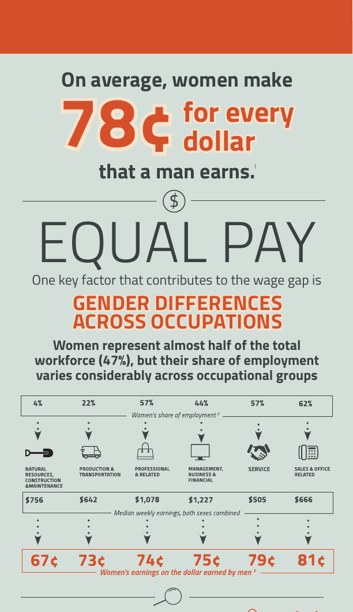
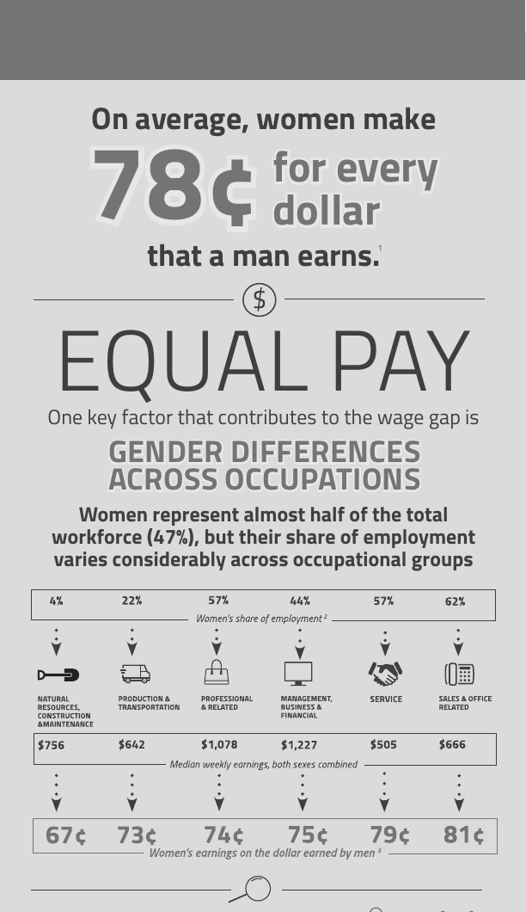
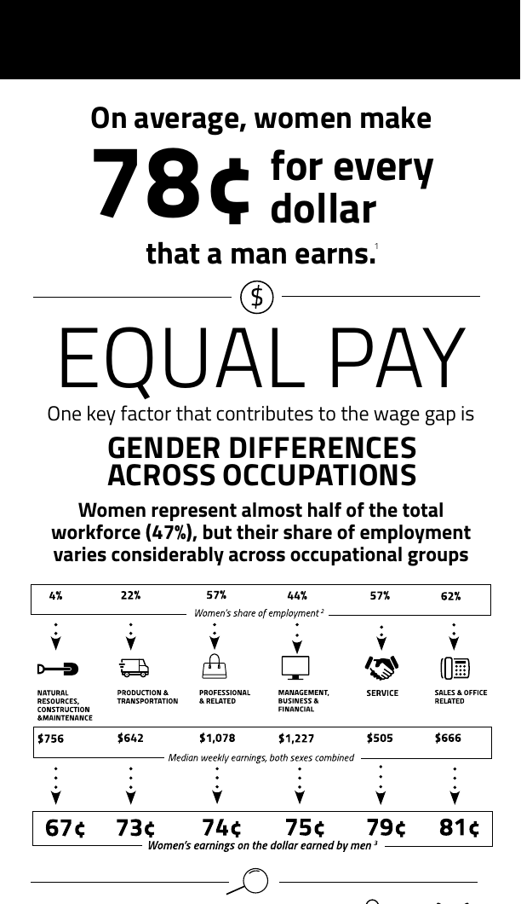
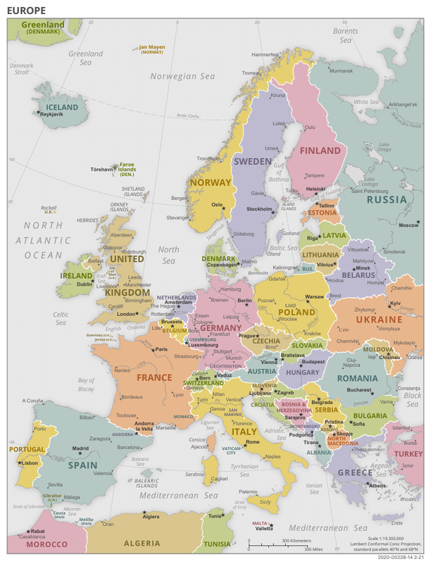
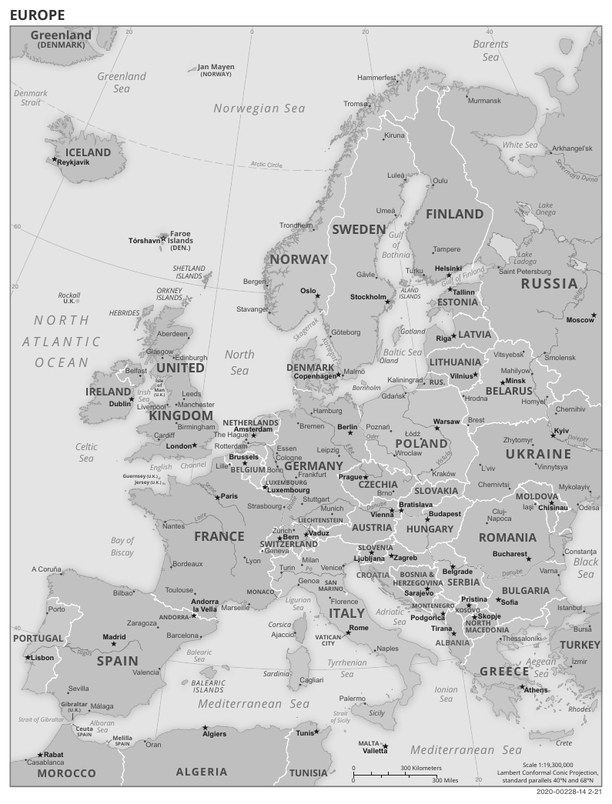
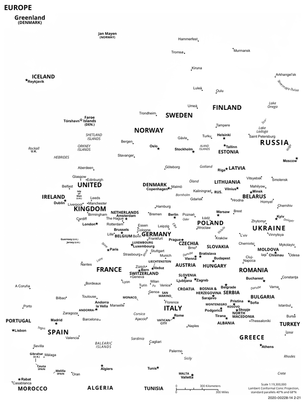

# Sumi

PDF の色をグレースケールまたは白黒 2 値に変換する Rust 製ライブラリ兼 CLI です。
ページを画像化せず、色指定だけを書き換えるので、テキスト検索・コピー・フォント・ベクター品質はそのまま残ります。
Ghostscript などの AGPL 製品には依存していません。

仕様は [sumi_spec.md](sumi_spec.md) を参照してください。仕様から変えた点は「[仕様との差分](#仕様との差分)」にまとめています。

## 変換例

Wikimedia Commons で公開されているパブリックドメインの PDF を変換した例です。画像は変換前後の PDF を poppler でレンダリングしたもので、インフォグラフィックは上部だけを切り出しています。

### インフォグラフィック

| 元の PDF | グレースケール | モノクロ |
|---|---|---|
|  |  |  |

```bash
sumi samples/equal-pay.pdf -o samples/equal-pay-grayscale.pdf
sumi samples/equal-pay.pdf -o samples/equal-pay-monochrome.pdf --mode monochrome
```

モノクロでも、見出し、数字、グラフはそのまま読めます。変換前後の PDF は [samples/](samples/) にあります。

出典: [Equal Pay Infographic](https://commons.wikimedia.org/wiki/File:Equal_Pay_Infographic.pdf)（U.S. Department of Labor、パブリックドメイン）

### 地図

| 元の PDF | グレースケール | モノクロ |
|---|---|---|
|  |  |  |

グレースケールでは、国ごとの濃淡の違いが残ります。モノクロでは淡い色がすべて白になり、塗り分けも海岸線も消えて地名だけが残ります。色の違いで情報を伝える資料は、グレースケールで変換してください。

出典: [Political map of Europe](https://commons.wikimedia.org/wiki/File:Political_map_of_Europe.pdf)（CIA World Factbook、パブリックドメイン）

## Ghostscript との比較

同じ PDF をグレースケールに変換し、Ghostscript と実行時間、メモリ使用量、出力を比べました。表の入力名のリンクから、計測に使った PDF を開けます。

### 実行時間

| 入力 | ページ | sumi | Ghostscript | 速度比 |
|---|---:|---:|---:|---:|
| [請求書](fixtures/chrome_invoice.pdf)（Chrome、0.34 MB） | 2 | 20 ms | 150 ms | 7.5 倍 |
| [請求書 50 ページ](bench/invoice-50pages.pdf)（Chrome、1.0 MB） | 50 | 59 ms | 2,441 ms | 41.2 倍 |
| [インフォグラフィック](https://upload.wikimedia.org/wikipedia/commons/f/f8/Equal_Pay_Infographic.pdf)（Adobe、0.30 MB） | 1 | 32 ms | 175 ms | 5.5 倍 |
| [NASA ファクトシート](https://upload.wikimedia.org/wikipedia/commons/7/79/0080_SLS_Fact_Sheet_10162019_PRINT_FINAL_%28656622902519%29.pdf)（Acrobat Distiller、0.30 MB） | 2 | 55 ms | 794 ms | 14.4 倍 |
| [ポスター](https://upload.wikimedia.org/wikipedia/commons/9/91/Best_Case_Scenarios_for_Copyright_-_poster.pdf)（cairo、5.9 MB） | 1 | 511 ms | 1,201 ms | 2.4 倍 |
| [地図](https://upload.wikimedia.org/wikipedia/commons/1/12/Political_map_of_Europe.pdf)（Aspose、6.7 MB） | 1 | 1,371 ms | 3,181 ms | 2.3 倍 |

10 回実行した中央値です。すべての PDF で sumi のほうが速く、差は 2.3〜41.2 倍でした。Ghostscript は PDF を解釈して描き直しますが、sumi は色の命令だけを書き換えるので、ページ数の多い帳票ほど差が開きます。

### メモリ使用量

| 入力 | sumi | Ghostscript | sumi / Ghostscript |
|---|---:|---:|---:|
| [請求書](fixtures/chrome_invoice.pdf)（0.34 MB） | 9.9 MB | 30.7 MB | 32% |
| [請求書 50 ページ](bench/invoice-50pages.pdf)（1.0 MB） | 20.6 MB | 86.0 MB | 24% |
| [インフォグラフィック](https://upload.wikimedia.org/wikipedia/commons/f/f8/Equal_Pay_Infographic.pdf)（0.30 MB） | 6.2 MB | 28.0 MB | 22% |
| [NASA ファクトシート](https://upload.wikimedia.org/wikipedia/commons/7/79/0080_SLS_Fact_Sheet_10162019_PRINT_FINAL_%28656622902519%29.pdf)（0.30 MB） | 8.1 MB | 43.0 MB | 19% |
| [ポスター](https://upload.wikimedia.org/wikipedia/commons/9/91/Best_Case_Scenarios_for_Copyright_-_poster.pdf)（5.9 MB） | 34.2 MB | 37.7 MB | 91% |
| [地図](https://upload.wikimedia.org/wikipedia/commons/1/12/Political_map_of_Europe.pdf)（6.7 MB） | 85.8 MB | 32.5 MB | 264% |

プロセスの最大常駐メモリ（maximum resident set size）の、10 回実行した中央値です。

- 6 件中 5 件で sumi のほうが少なく、Ghostscript の 19〜91% で済みました。1 MB 前後までの PDF では 19〜32% です。
- sumi は PDF 全体をメモリに読み込んで変換するので、ファイルが大きいほどメモリを多く使います。6.7 MB の地図では、sumi のほうが多く使いました（85.8 MB と 32.5 MB）。
- Ghostscript は 1 ページの PDF では 28〜43 MB でしたが、50 ページの請求書では 86.0 MB を使いました。

### 出力

| 入力 | 元の PDF | sumi | Ghostscript |
|---|---:|---:|---:|
| [請求書](fixtures/chrome_invoice.pdf) | 0.34 MB | 0.31 MB | 0.18 MB |
| [請求書 50 ページ](bench/invoice-50pages.pdf) | 1.03 MB | 0.98 MB | 1.13 MB |
| [インフォグラフィック](https://upload.wikimedia.org/wikipedia/commons/f/f8/Equal_Pay_Infographic.pdf) | 0.30 MB | 0.30 MB | 0.26 MB |
| [NASA ファクトシート](https://upload.wikimedia.org/wikipedia/commons/7/79/0080_SLS_Fact_Sheet_10162019_PRINT_FINAL_%28656622902519%29.pdf) | 0.30 MB | 0.84 MB | 0.51 MB |
| [ポスター](https://upload.wikimedia.org/wikipedia/commons/9/91/Best_Case_Scenarios_for_Copyright_-_poster.pdf) | 5.90 MB | 5.90 MB | 4.51 MB |
| [地図](https://upload.wikimedia.org/wikipedia/commons/1/12/Political_map_of_Europe.pdf) | 6.70 MB | 7.11 MB | 7.20 MB |

- **出力サイズ**: 写真を含む NASA ファクトシートやポスターは、Ghostscript のほうが小さくなりました。sumi は JPEG 画像を可逆圧縮（Flate）で保存し直し、Ghostscript はフォントや画像を圧縮し直すためです。
- **見た目**: 両方の出力をレンダリングして比べたところ、見た目はほぼ同じで、どちらにも色は残っていませんでした。
- **テキスト**: sumi の出力から抽出したテキストは、6 件すべてで元の PDF と完全に一致しました。Ghostscript の出力では、NASA ファクトシートの合字「fi」「fl」が「Þ」「ß」として抽出され、「first」で検索できなくなりました。請求書では文字の抽出順が変わり、「発行日」が一続きの文字列として見つからなくなりました（文字自体の欠落はありません）。

### 比較方法

- **環境**: Apple M1 Pro（メモリ 16 GB）、macOS 26.5.2。sumi 0.1.0（`cargo build --release`）、Ghostscript 10.05.1（Homebrew）。2026 年 9 月 11 日に計測しました。
- **実行方法**: アプリケーションから呼び出すのと同じく、どちらもコマンドとして実行し、プロセスの起動時間も含めて計測しました。PDF ごとに 1 回ウォームアップしてから 10 回実行しています。時間とメモリは `/usr/bin/time -l` で取得しました。
- **コマンド**:

  ```bash
  sumi input.pdf -o output.pdf --overwrite

  gs -q -dNOPAUSE -dBATCH -dSAFER -sDEVICE=pdfwrite \
     -sColorConversionStrategy=Gray -dProcessColorModel=/DeviceGray \
     -o output.pdf input.pdf
  ```

- **出力の確認**: poppler の `pdftoppm` でレンダリングして色の付いたピクセルがないこと、`pdftotext` で抽出したテキストが元の PDF と一致するかを調べました。
- **比べていないもの**: Ghostscript にはベクターのまま白黒 2 値にする機能がないため、比べたのはグレースケール変換だけです。
- **入力**:

  | 入力 | PDF | 出典 |
  |---|---|---|
  | 請求書 | [chrome_invoice.pdf](fixtures/chrome_invoice.pdf) | [fixtures/src/invoice.html](fixtures/src/invoice.html) を Chrome で PDF にしたもの |
  | 請求書 50 ページ | [invoice-50pages.pdf](bench/invoice-50pages.pdf) | `fixtures/src/invoice.html` を 25 回繰り返して Chrome で PDF にしたもの |
  | インフォグラフィック | [Equal_Pay_Infographic.pdf](https://upload.wikimedia.org/wikipedia/commons/f/f8/Equal_Pay_Infographic.pdf) | [Equal Pay Infographic](https://commons.wikimedia.org/wiki/File:Equal_Pay_Infographic.pdf)（パブリックドメイン） |
  | NASA ファクトシート | [0080_SLS_Fact_Sheet_…pdf](https://upload.wikimedia.org/wikipedia/commons/7/79/0080_SLS_Fact_Sheet_10162019_PRINT_FINAL_%28656622902519%29.pdf) | [SLS Fact Sheet](https://commons.wikimedia.org/wiki/File:0080_SLS_Fact_Sheet_10162019_PRINT_FINAL_(656622902519).pdf)（パブリックドメイン） |
  | ポスター | [Best_Case_Scenarios_for_Copyright_-_poster.pdf](https://upload.wikimedia.org/wikipedia/commons/9/91/Best_Case_Scenarios_for_Copyright_-_poster.pdf) | [Best Case Scenarios for Copyright - poster](https://commons.wikimedia.org/wiki/File:Best_Case_Scenarios_for_Copyright_-_poster.pdf)（CC0） |
  | 地図 | [Political_map_of_Europe.pdf](https://upload.wikimedia.org/wikipedia/commons/1/12/Political_map_of_Europe.pdf) | [Political map of Europe](https://commons.wikimedia.org/wiki/File:Political_map_of_Europe.pdf)（パブリックドメイン） |

- **再現手順**:

  ```bash
  cargo build --release
  python3 bench/fetch.py        # 入力 PDF を bench/inputs に用意（Wikimedia Commons からダウンロード）
  python3 bench/bench.py        # 計測。結果は bench/results.json
  ```

  50 ページの請求書は、計測に使ったものを `bench/invoice-50pages.pdf` に置いています。作り直すときは `python3 bench/make_batch.py` を実行してください（Google Chrome が必要）。

1 台のノート PC での計測なので、数値は環境によって変わります。特に小さな PDF では、プロセスの起動時間が大きな割合を占めます。Ghostscript の結果は、オプションによっても変わります。

## インストール

[GitHub Releases](https://github.com/champierre/sumi/releases/latest) からビルド済みの CLI をダウンロードできます。

| OS | ファイル |
|---|---|
| macOS（Apple Silicon） | `sumi-aarch64-apple-darwin.tar.gz` |
| macOS（Intel） | `sumi-x86_64-apple-darwin.tar.gz` |
| Windows（x64） | `sumi-x86_64-pc-windows-msvc.zip` |
| Linux（x86_64） | `sumi-x86_64-unknown-linux-musl.tar.gz` |
| Linux（arm64） | `sumi-aarch64-unknown-linux-musl.tar.gz` |

```bash
# 例: macOS（Apple Silicon）
curl -L https://github.com/champierre/sumi/releases/latest/download/sumi-aarch64-apple-darwin.tar.gz | tar xz
sudo mv sumi-aarch64-apple-darwin/sumi /usr/local/bin/
```

Linux 版は静的リンク（musl）なので、ディストリビューションを問わず動きます。ブラウザでダウンロードした macOS 版がブロックされる場合は、`xattr -d com.apple.quarantine sumi` を実行してください。

### ソースからビルド

```bash
cargo install --git https://github.com/champierre/sumi sumi-cli
# または
cargo build --release   # => target/release/sumi
```

Rust 1.88 以降が必要です（edition 2024）。

## CLI

```bash
sumi input.pdf -o output.pdf
sumi input.pdf -o output.pdf --mode monochrome --threshold 0.5
cat input.pdf | sumi - -o - > output.pdf
```

| オプション | 説明 |
|---|---|
| `-o, --output <FILE>` | 出力先。`-` で標準出力 |
| `--mode grayscale\|monochrome` | 変換方式（既定: `grayscale`） |
| `--threshold <0.0-1.0>` | モノクロ時の閾値（既定: `0.5`）。この値未満の濃さは黒になる |
| `--dither` | モノクロ時、画像を閾値ではなく誤差拡散（Floyd–Steinberg）で 2 値化する |
| `--strict` | 変換できない箇所があれば、元の色のまま出力せずにエラーにする |
| `--overwrite` | 出力ファイルが既にあれば上書きする |
| `--timeout <SECONDS>` | 指定秒数を超えたら中断する |
| `-v, --verbose` | 変換した件数を表示する |

変換できなかった箇所は、元の色のまま残して `sumi: warning: ...` を標準エラーに出します（`--strict` を付けるとエラー終了）。
出力はいったん一時ファイルに書いてから rename するので、失敗時に壊れたファイルが残りません。

### 終了コード

| コード | 意味 |
|---|---|
| 0 | 成功 |
| 1 | その他のエラー（リソース上限超過など） |
| 2 | 引数が不正（出力ファイルが既に存在する、入出力が同じファイル、など） |
| 3 | PDF として読めない |
| 4 | 未対応の PDF（暗号化 PDF、または `--strict` で変換できない箇所があった） |
| 5 | 入出力エラー |
| 6 | タイムアウト |

## Rust API

```rust
use sumi_core::{convert, convert_bytes, ConvertOptions, Mode};

let mut options = ConvertOptions::default();
options.mode = Mode::Monochrome;
options.threshold = 0.6;
let report = convert("input.pdf", "output.pdf", &options)?;

// メモリ上で変換する
let converted = convert_bytes(&std::fs::read("input.pdf")?, &ConvertOptions::grayscale())?;
println!("{} images converted, {} warnings", converted.report.images, converted.report.warnings.len());

// 簡易 API
sumi_core::grayscale("input.pdf", "output.pdf")?;
```

`ConvertOptions` と `Report` は `#[non_exhaustive]` です。将来フィールドを追加しても破壊的変更にならないよう、`ConvertOptions::default()` などで作ってからフィールドを変更してください。

## Rails からの利用

```ruby
require "open3"

class PdfGrayscaleConverter
  class ConversionError < StandardError; end

  SUMI = ENV.fetch("SUMI_PATH", "sumi")

  def self.call(input_path:, output_path:)
    # Tempfile のパスは作成済みなので --overwrite が必要
    _stdout, stderr, status = Open3.capture3(
      SUMI, input_path.to_s, "-o", output_path.to_s, "--overwrite", "--timeout", "30"
    )
    raise ConversionError, stderr unless status.success?

    output_path
  end
end
```

ファイルを介さずに、`Open3.capture3(SUMI, "-", "-o", "-", stdin_data: pdf_bytes, binmode: true)` のように標準入出力で渡すこともできます。

## 変換対象

| 対象 | 処理 |
|---|---|
| コンテンツストリームの `rg` `RG` `k` `K` `g` `G` | `g` / `G` に置き換え |
| `cs` `CS` `sc` `SC` `scn` `SCN` | 色空間を追跡し（`q`/`Q` の退避・復元を含む）、`/DeviceGray` に置き換え |
| 色空間 | DeviceGray/RGB/CMYK、CalGray/CalRGB、Lab、ICCBased（N=1/3/4）、Indexed、Separation、DeviceN（Type 0/2/3/4 関数を評価）、Pattern（下地色あり） |
| Form XObject、タイリングパターン、Type 3 フォントのグリフ | 再帰的に変換 |
| 画像 XObject | Indexed はパレットだけをグレーに差し替え（画素データは維持）。その他は 8bit グレー（モノクロ時は 1bit）で Flate 圧縮し直す。FlateDecode（Predictor 付きを含む）、LZW、ASCII85、ASCIIHex、RunLength、DCTDecode（JPEG）に対応。カラーキーの `/Mask` は SMask に変換 |
| インライン画像（`BI`…`EI`） | 同上 |
| シェーディング（グラデーション） | 関数を 256 点（関数型シェーディングは 33×33 点）でサンプリングし、グレーのサンプル関数に置き換え |
| 透明グループの `/CS` | `/DeviceGray` に変更 |
| 注釈 | 外観ストリーム（`/AP`）、`/C` `/IC`、`/MK` の `/BG` `/BC`、`/DA` |
| フォームフィールド | AcroForm と各フィールドの `/DA` |

テキスト描画命令、フォント、パス、文字列、コメントなど色以外のバイト列は、元のままコピーします。

### 変換式

PDF 仕様（ISO 32000-1 10.3）が示す DeviceRGB/DeviceCMYK → DeviceGray の式を使っています。Acrobat や Ghostscript（ICC を使わない場合）と同じ式です。

```text
Gray = 0.30 × R + 0.59 × G + 0.11 × B
Gray = 1 − min(1, 0.30 × C + 0.59 × M + 0.11 × Y + K)
```

モノクロでは `Gray < threshold` を黒、それ以外を白にします。

## 制限事項

- **CMYK の見た目**: CMYK には上記の簡易式を使うため、ICC で色管理した表示よりシアンなどが明るくなります（例: シアン 100% は 0.70。poppler の表示をグレー化すると約 0.5）。
- **モノクロ化による情報の欠落**: 閾値で 2 値化するため、黄色など明るい色の文字は白い紙の上で消えます。薄い背景色も消えます。白抜き文字が背景と同化することもあります。
- **未対応で元の色のまま残るもの**（警告を出力）: 関数を持たないメッシュシェーディング（Type 4〜7）、JPEG 2000 / JBIG2 / CCITT で符号化されたカラー画像、複数のフィルタにパラメータがあるストリーム。
- **暗号化 PDF** は変換しません（権限設定だけの PDF も含む）。
- **壊れた PDF**: パーサ（lopdf）が読めないオブジェクトがページの描画に必要な場合はエラーにします。描画に関係しないオブジェクト（構造ツリーなど）であれば、警告を出したうえで取り除いて変換します。
- JPEG 画像は Flate で可逆圧縮し直すので、写真が多い PDF はサイズが増えることがあります。
- ソフトマスク（`/SMask` のグループ）の中身は、表示色に影響しないので変換しません。

## 仕様との差分

| 仕様 | 実装 | 理由 |
|---|---|---|
| PDF パーサ・xref・writer を自前実装 | [lopdf](https://crates.io/crates/lopdf)（MIT）を使用し、コンテンツストリームの字句解析と色変換だけを自前で実装 | incremental update、xref stream、object stream、壊れた xref の修復などを最初から扱えるため。xref stream と object stream は v0.3 予定だったが、この構成で最初から読める |
| 変換式に 0.2126 / 0.7152 / 0.0722 を使用 | 0.30 / 0.59 / 0.11 | PDF の色値はガンマ補正済みの値で、Rec.709 の係数はリニア値向けのため。PDF 仕様の式に合わせた |
| DeviceGray は変更しない | モノクロ時は `g` / `G` も 2 値化 | 仕様どおりだとモノクロに中間調が残るため |
| `SumiError` のバリアント | `InvalidPdf(String)`、`EncryptedPdf`、`Unsupported(Vec<String>)`、`InvalidOptions`、`LimitExceeded`、`Io(io::Error)`、`Internal` | エラー内容を保持するため。`UnsupportedPdfVersion` はヘッダのバージョンがあてにならないので廃止 |
| `convert(input, output, options)` | `convert(input, output, &options)`、`convert_bytes`、`monochrome` を追加 | Web サービスでメモリ上で変換できるように |
| CLI オプション | `--dither` `--strict` `--timeout`、標準入出力（`-`）、終了コード 6 を追加 | |
| 画像対応は v0.2 | v0.1 で対応 | 帳票の社印などが画像であることが多いため |

## 安全性

- 展開後のストリームサイズ（既定 256MB）、画像の画素数（既定 1 億）、フォームなどの入れ子の深さ（既定 32）に上限があります（`Limits`）。上限を超えるストリームはエラーになります。
- 変換中の panic は `SumiError::Internal` として返します。

## テスト

```bash
cargo test
```

- `crates/sumi-core/tests/convert.rs`: メモリ上で組み立てた PDF による各機能のテスト
- `crates/sumi-core/tests/fixtures.rs`: `fixtures/` の実物に近い PDF（Chrome、Quartz、Ghostscript の object stream 版、LibreOffice）で、ページ数・MediaBox・テキスト命令が変わらないこと、色演算子が残らないことを確認します。`pdftoppm`（poppler）がインストールされていれば、出力をレンダリングして色付きのピクセルがないことも確認します（poppler はテスト時に外部コマンドとして呼ぶだけです）。
- `crates/sumi-cli/tests/cli.rs`: 終了コード、上書き確認、標準入出力

fixture の再生成方法は [fixtures/README.md](fixtures/README.md) を参照してください。

## リリース

`v0.1.0` のように `Cargo.toml` のバージョンと同じタグを push すると、GitHub Actions（`.github/workflows/release.yml`）が各プラットフォーム向けの CLI をビルドし、GitHub Releases に公開します。

```bash
git tag v0.1.0
git push origin v0.1.0
```

## ライセンス

[MIT](LICENSE)。依存クレートはすべて MIT / Apache-2.0 / BSD / Zlib 系のライセンスです。
